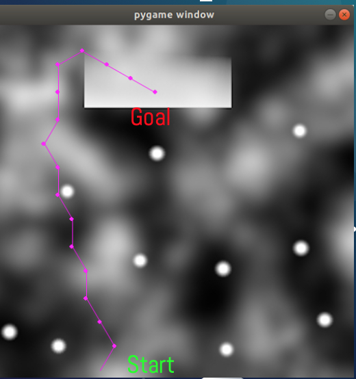

# Planning For Optimized Surface Exploration On Mars
## Overview

Planetary rovers are essential for collecting data on celestial bodies. They give us insight into the conditions 
of the body without risking human lives. In order to maximize the amount of data obtained, these rovers must be 
able to travel to different areas. Due to the delay in communication between the rover and Earth, these rovers 
must be able to travel autonomously. They must do so without getting stuck or damaged while also conserving power 
by limiting actions such as climbing unnecessary hills. The rovers use path planning algorithms to find a safe 
and optimal path between its current location and a given goal location. Research is constantly evolving path 
planning algorithms, making them more efficient and less computationally expensive. Advancements in physics-based 
simulation software such as Gazebo allow roboticists to test different path planning algorithms on a rover model 
in an environment similar to its destination. This project compares the performance of RRT*, Dijkstra and A*. 

## Dependencies

- ROS Melodic
- Ubuntu 18
- Curiosity Mars Rover Project [Link](https://bitbucket.org/theconstructcore/curiosity_mars_rover/src/master/)


## Demo Steps

Run Gazebo: -
```
Terminal 1:
cd catkin_ws
source devel/setup.bash
roslaunch PlanningForOptimizedSurfaceExplorationOnMars main_real_mars.launch
```
Simulator will be in paused state. Run path planning algorithm: -
```
Terminal 2:
cd catkin_ws
source devel/setup.bash
rosrun PlanningForOptimizedSurfaceExplorationOnMars AStarMain.py 
```
The algorihtm will take some time to calculate path. Once it is done it will say done. Then unpause the simulation in 
gazebo, then immediately press enter in terminal 2 to excute rover controller.


## Results

Name            |  Path
:-------------------------:|:-------------------------:
RRT*  |   
A* |
Dijkstra |   


## Contributors

-Toyas Dhake
-Robotics engineer, University of Maryland College Park.

-Loic Barret
-Robotics engineer, University of Maryland College Park.

-Raghav Agrawal
-Robotics engineer, University of Maryland College Park.